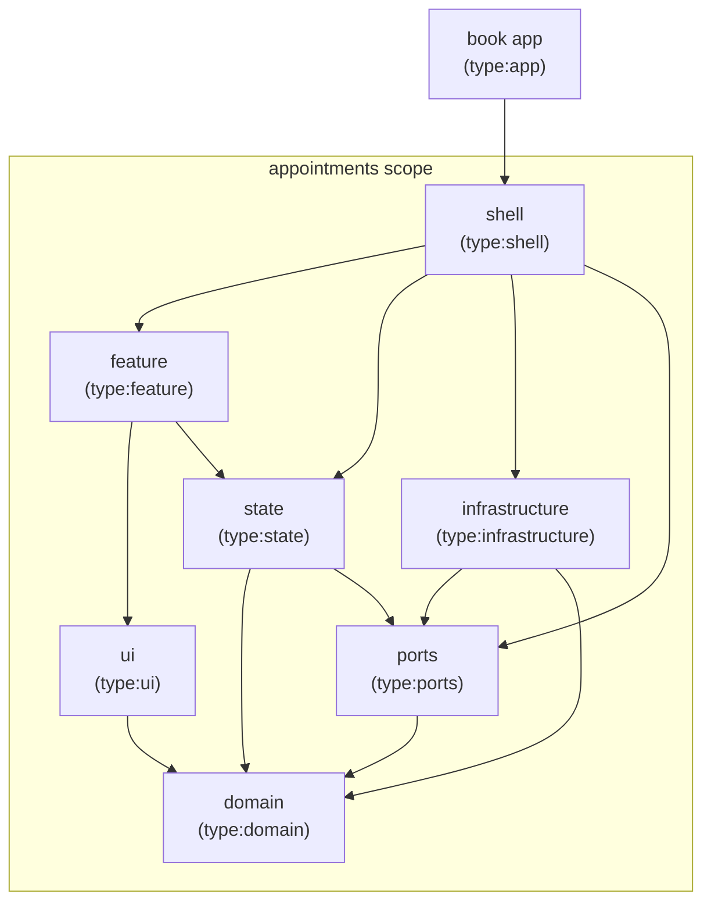
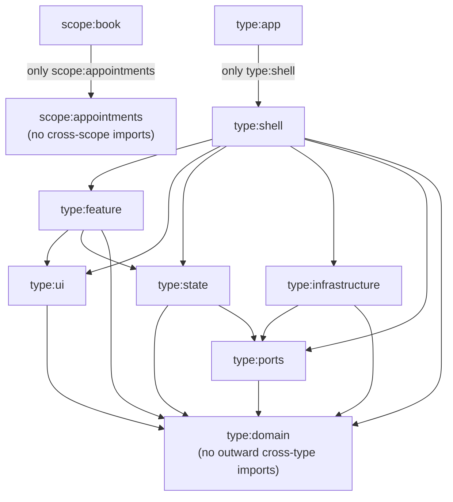
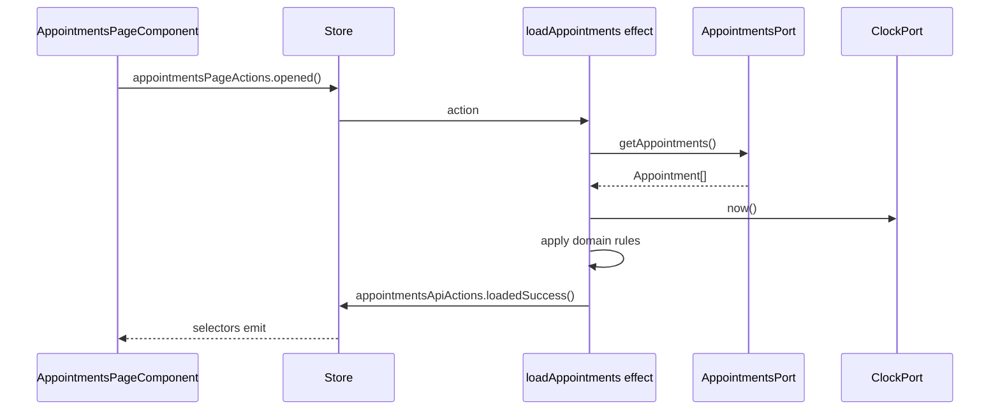

# Hexa

Appointment-booking exercise built with Angular and a local JSON Server API.

## Architecture review

Read [the 2026-08-07 architecture review](docs/architecture-review-2026-08-07.md),
which describes the earlier use-case composition.

Read [why the state layer is still classic NgRx](docs/state-management-signal-store-2026-08-09.md)
for what a move to the signal store would take, and what would have to change
for it to be worth doing.

## Architecture boundaries

The appointment-booking slice is split into Nx libraries. Arrows show allowed
dependencies between the current projects.



### Nx dependency rules

[`eslint.config.mjs`](eslint.config.mjs) enforces these directions for any
project carrying the corresponding tags. Every arrow means "may depend on";
all other cross-project directions are rejected by
`@nx/enforce-module-boundaries`.



## State management

NgRx holds both the page state and this screen's loading operation in
`libs/appointments/state`.

- **Actions** are named after their source, not after the reducer:
  `appointmentsPageActions` for user intents, `appointmentsApiActions` for results.
- **The reducer** stores `Appointment` values from the domain plus a `status`
  and an `errorMessage`, so loading, empty, and failed states are distinguishable.
- **Effects** are the Redux use cases. They call the abstract appointments and
  clock ports, apply the domain rules, then translate the result into actions.
  The effect never reaches an HTTP client or concrete adapter.
- **Selectors** derive what the template needs; components only dispatch and select.



`provideAppointmentsState()` registers the feature slice. The shell registers
the functional Effect and binds its ports to adapters. The shell provider is
applied on the appointments route in
[`libs/appointments/shell`](libs/appointments/shell/src/lib/appointments.routes.ts),
so the port bindings and the state slice live in the route's environment
injector rather than the application root. The root store and the devtools live
in [`apps/book/src/app.config.ts`](apps/book/src/app.config.ts).

## Trusting the API payload

`HttpAppointmentsAdapter` is the only place that knows what the API returns. The
API describes an appointment's start as a `date` and a `startTime`; the domain
wants the single instant those two name. Translating between them is the reason
the seam exists, and `AppointmentDto` never leaves the file.

Typing the response — `http.get<AppointmentDto[]>` — would be a claim rather
than a check. The type argument is erased, nothing inspects the body, and a
vendor that breaks its contract breaks a layer that did nothing wrong: a `null`
customer name used to throw inside a domain rule, and an unparsable date became
an `Invalid Date` that the same rule then dropped without a word. The adapter
asks for `unknown` and earns the type instead, so that everything past this file
may trust what it receives.

A [zod/mini](https://zod.dev) schema is that contract in executable form.
`z.infer` derives `AppointmentDto` from it, so the shape and the checks are one
declaration and cannot drift apart.

**Structure is checked here; meaning stays in the domain.** An empty customer
name is a valid string and passes the schema. That an appointment without a name
is not worth showing is a decision about appointments, so
[`filterAppointmentsWithCustomerName`](libs/appointments/domain/src/lib/appointment.rules.ts)
still makes it. A test pins that boundary, because `.min(1)` is one word away and
would quietly move a business rule into infrastructure.

One check resists the schema. `2026-13-45` matches the date pattern — the digits
are in the right places — and `new Date` rolls it over to February 2027 rather
than refusing. The only way to know a string named the instant it claimed is to
build the date and read the parts back.

`zod/mini` rather than the chained API, decided by measurement rather than taste:
both build from identical source — only the import differs — and the chained one
costs several times more transferred bytes, because its validators hang off the
schema instance where a bundler cannot drop the ones you never call. Neither
touches the initial bundle, so validation is paid for only by whoever opens the
route. `npx nx build book` prints the numbers if you want to check the claim.

## Choosing a data source

The data source is selected by which shell entry point the build can reach, not
by a runtime branch. The normal route dynamically imports the primary entry
point and gives it only the API configuration it needs:

```ts
import('@hexa/appointments-shell').then((m) => m.appointmentsRoutes({ apiBaseUrl }));
```

The `memory` build replaces that route file with one that imports the explicit
secondary entry point:

```ts
import('@hexa/appointments-shell/memory').then((m) => m.appointmentsRoutes());
```

A secondary entry point is another import door into the same workspace library.
The primary infrastructure entry point exports the HTTP and system-clock
adapters; `@hexa/appointments-infrastructure/memory` alone exports the in-memory
adapter and fixtures. Since the production route cannot reach either `/memory`
entry point, Angular leaves those modules out of its graph instead of merely
choosing not to instantiate them at runtime.

The shell remains lazy: a static import from `app.config.ts` is rejected by
lint because it would pull the feature into the initial bundle. The production
build also writes `stats.json`, and `npx nx verify-production-bundle book`
checks that the HTTP adapter is present while both memory entry points are
absent.

`serve-memory` is its own target rather than a `serve` configuration, because
Nx `dependsOn` is per-target: a configuration would still have started
json-server, which defeats the point.

## Getting started

Install dependencies:

```sh
npm install
```

Run the Angular application against the API:

```sh
npx nx serve book
```

Or run it with no backend at all, on the in-memory adapter's seed data:

```sh
npx nx serve-memory book
```

## Appointment API

Start the API at `http://localhost:3000`:

```sh
npm run api
```

The API supports:

- `GET /appointments`
- `GET /appointments?date=YYYY-MM-DD`
- `POST /appointments`

json-server stands in for a backend owned by another team, so its shape is not
ours to bend: when the domain wants something the API does not provide, the
adapter translates rather than the server changing to match. [`CLAUDE.md`](CLAUDE.md)
states the rule and where the line falls.

### The demo data is generated, not checked in

`npm run api` runs [`server/seed.mjs`](server/seed.mjs) first, which writes
`server/db.json` from [`server/db.seed.json`](server/db.seed.json). The seed
stores a `dayOffset` per appointment and the script turns it into the absolute
`date` the API is required to serve, so the fixtures are always arranged around
today.

They used to be absolute, and they rotted: every seeded date drifted into the
past, the domain rule discarded all of them, and `npx nx serve book` rendered an
empty list while `serve-memory` kept working — the in-memory adapter had stored
offsets all along. Offsets in both places is what stops the two data sources
disagreeing again.

`server/db.json` is generated and gitignored, so restarting the API discards
anything a `POST` persisted. There is nothing to restore by hand.

### Bruno collection

Start the API first, then import the
[Appointment Booking API collection](bruno/appointment-booking-api) in Bruno and
select the `Local` environment. That environment is generated by the same script,
because two of its requests filter on a date and a hard-coded one goes stale the
moment the fixtures move — which is exactly what happened: one request had been
returning an empty list, and another asserted a start time no seeded appointment
had, both unnoticed.

The script derives those dates from the seed rather than repeating them: it finds
a day holding exactly one appointment and a day holding exactly two. If the seed
ever stops offering both, seeding **fails** and the API does not start, rather
than leaving a request that quietly describes an API nobody serves.

## Checks

```sh
npm test
npx nx run-many -t lint
npx nx run-many -t typecheck
npx nx build book
npx nx e2e book-e2e
```

**These run on `git push`, not on request**, and then again on what landed.
[`lefthook.yml`](lefthook.yml) is the copy that runs before the push, so a broken
commit never reaches the remote; [`.github/workflows/checks.yml`](.github/workflows/checks.yml)
runs the same three stages, in the same order, under the same names. `lefthook`
installs the hook from its own `postinstall`, so `npm install` is all a fresh
clone needs — except Playwright's browser, which is downloaded on demand:

```sh
npx playwright install chromium
```

To read the remote half:

```sh
gh run list --workflow=checks.yml
gh run watch
```

`LEFTHOOK=0 git push` skips the local gate. Reach for it when the check is wrong,
not when it is slow; if it is slow, that is the trade-off below asking to be
revisited. Skipping no longer means unchecked — it means finding out from a red
run rather than from a blocked push, on a `main` anyone may be reading.

To run the gate without pushing — the whole thing, in the order the hook runs it:

```sh
npx lefthook run pre-push --force
```

`--job format`, `--job checks` or `--job e2e` narrows it to one stage while you
iterate.

**`--force` is not optional.** Lefthook resolves the push range before it runs
anything and skips every job when that range is empty, which is what a
`main` already level with its upstream looks like. The output then reads
`(skip) no matching push files` and the summary is green — a gate that ran
nothing, indistinguishable at a glance from a gate that passed. `--force` says
run regardless of what changed.

To watch a gate refuse rather than pass, break something and run it again:
double-space a `const` for `format`, import `@angular/core` into `domain` for
lint, put `{{ appointment().nope }}` in a template for the build. Each one is a
mistake the gate exists to catch, and the only way to know it still catches it
is to make it.

`npm test` runs every project's `test` target. The `ui` library goes through
`@nx/angular:unit-test` because its component specs need the Angular AOT compiler
for signal inputs; every other library runs on plain Vitest.
Both are covered by that one command.

`npx nx run-many -t lint` is not only a style check. `@nx/enforce-module-boundaries`
rejects a wrong-way project dependency _and_, through `bannedExternalImports`, an
`@angular/*` or `@ngrx/*` import into `domain`, `ports` or `application`. Adding
one deliberately turns lint red.

`npx nx run-many -t typecheck` exists because Vitest transpiles rather than
typechecks, so a type error survives a green test run. Each project runs `tsc
--noEmit` over both its lib and its spec `tsconfig` — the lib one excludes
`*.spec.ts`, and the escape this guards against was in a spec.

`npx nx e2e book-e2e` is Playwright, and it is currently one smoke test. It runs
against `serve-memory`, so it starts its own dev server on the in-memory adapter
and needs no json-server. Chromium only: nothing here is browser-specific yet.
Artifacts land in `dist/.playwright`, which is already ignored; CI uploads that
directory as `playwright-report` when — and only when — the e2e step is the step
that failed, so a trace from a remote failure is downloadable.

Nx starts the dev server, not Playwright: `@nx/playwright/plugin` reads
`webServer.command` out of the config and makes `book:serve-memory` a continuous
dependency of the inferred `e2e` target. That is why `reuseExistingServer` is
unconditionally `true` rather than `!process.env.CI`. `npx nx show project
book-e2e --json` prints the target Nx actually inferred.

For a coverage report across `libs/`:

```sh
npm run test:coverage
```

## Deliberate trade-offs

These are decisions, not oversights. Each has a stated trigger for revisiting.

**The gate runs twice, and the pre-push half still runs e2e.** Format, lint,
typecheck, unit tests, an Angular build and Playwright, all before a push is
allowed — and all again in CI. Running both is redundant on purpose: `main` is
unprotected, so CI reports a failure it cannot prevent, and the hook is what
keeps a broken commit off a branch anyone may clone. Nx caches all of it, e2e
included, so a repeat push is mostly cache reads. The trigger is unchanged — the
first `LEFTHOOK=0` reached for because the gate is slow rather than because the
check is wrong — but the fix now on the shelf is to drop `e2e` from
`lefthook.yml` and let CI own it, not to delete the check. Protecting `main` on
the `checks` job would make that obviously right, by turning CI into prevention.

**One `run-many`, not one job per target.** `lefthook.yml` groups lint,
typecheck, test and build into a single command, and
[`checks.yml`](.github/workflows/checks.yml) repeats it as one step in one job.
Splitting them would name each failure in lefthook's own summary, at the cost of
four Nx processes contending for one daemon and one cache. In CI the cost is
worse and the benefit is already paid: Nx disables its daemon there, so each job
would recompute the project graph from cold on top of its own `npm ci`, and both
`appointments-ui:test` and `e2e` would rebuild the Angular app separately —
while GitHub names the failing step and times it without any of that. Revisit if
a failure ever becomes hard to locate in the combined output.

**CI runs `run-many` on one runner, not `affected` across a matrix.** `affected`
would let CI pass a change the hook fails, and `LEFTHOOK=0 git push` is only safe
while the two run the same commands. It also buys little here: every library
reaches `domain`, so the common change is affected-everywhere. Revisit the first
time `npx nx affected -t lint typecheck test build --base=HEAD~1` selects a
strict subset on a change you actually made **and** you were waiting on the full
run — both halves, not either.

**No Nx Cloud, and no restored Nx cache in CI either.** One contributor and a
graph this size do not repay an account, a token secret and a third-party
dependency. The obvious substitute — `actions/cache` on `.nx/cache` — does not
work: since Nx 21 the cache _index_ is a SQLite file under `.nx/workspace-data`
whose name is derived from the machine, so restoring the artifacts alone
restores an empty index and hits nothing. Only npm's download cache is kept.
Revisit at the first CI run you sit and wait on; the experiment is one throwaway
commit printing `/etc/machine-id` and `ls .nx/workspace-data` on two runs, and if
that id is stable, cache both paths on a rolling key. If it is not, the honest
answer is Nx Cloud or a self-hosted remote cache, and this entry is the one that
was wrong.

**Ports return `Observable`.** `AppointmentsPort` is typed
`Observable<Appointment[]>`, so `rxjs` sits in the ports and application
libraries alongside the domain. This is pragmatic in an Angular app and costs
nothing today. It stops being free if the core is ever consumed outside RxJS —
a Node CLI, a worker — or if a port's stream semantics (does it complete? does
it re-emit?) become part of the contract without being written down here.
Revisit at the first non-Angular consumer.

**Past appointments are filtered on the client.** The API supports
`GET /appointments?date=YYYY-MM-DD`, but `HttpAppointmentsAdapter` fetches
everything and `filterCurrentAndFutureAppointments` discards the past in the
domain. That keeps the rule in the core where it is testable without a server,
which is the right call for a demo dataset and the wrong one at a few thousand
rows. The trigger is the first slow page load; the fix is a port method that
takes a criterion, not moving the rule into the query.

**One bad record fails the whole batch.** A malformed appointment aborts the
request and the page shows an error, instead of being skipped so that the rest
can render. Dropping it quietly would be the silent data loss this boundary
exists to prevent, and a demo dataset has no rows to spare. That reverses on a
large feed from a vendor who is routinely a little wrong: there, one bad row
hiding forty good ones is the worse failure. The trigger is the first support
question about a missing appointment; the fix is to collect the faults and
report them alongside the results, not to ignore them.

**Re-routing is a domain predicate the card calls directly.**
`isReroutedToAnotherAdvisor` lives in `domain` with the two filters, but reaches
the screen through `AppointmentCardComponent` rather than through the use case,
the store, or a selector. It derives from the appointment alone, it changes
nothing about which appointments are returned, and exactly one component asks the
question — routing it through `application` and `state` would add two hops that
carry no decision. The rule still cannot be edited from the UI layer: `ui` may
import `domain`, and that is the only direction the boundary allows. Two things
reverse this. A second consumer — a filter, a count in the header, anything that
needs _which_ appointments are re-routed rather than _whether this one is_ — makes
it a selector. A rule that needs anything an `Appointment` does not carry, such
as who the receiving advisor is or whether they are free, makes it a use-case
output, because that needs a port.

**Classic NgRx, not the signal store.** `@ngrx/signals/events` would keep the
dispatch this design depends on — a component raises a named event and never
calls a method that changes state — so the move is mechanical rather than a
redesign, and `domain`, `ports`, `application` and `infrastructure` would not
change by a line. That last part is the argument for doing it eventually and
also the reason it is not urgent: it is evidence about a boundary that is
already holding. What it costs today is Redux DevTools, which `@ngrx/signals`
does not ship and whose third-party replacement does not yet accept this
workspace's Angular, plus the two lines binding an event to its reducer and its
handler, which no framework-free spec can reach. Both triggers that reverse this
are recorded in
[the decision record](docs/state-management-signal-store-2026-08-09.md).

**One feature, eight libraries.** Two ports, two DI tokens, an effect, a reducer
and three selectors around three small rules. On a product this ratio would be
the finding; here the structure is the deliverable. The honest test is the
_second_ feature: if booking an appointment reuses `domain`, `ports` and
`application` as they stand, the granularity paid off. If it needs a new library
at every layer to add one form, `ports` should merge into `application`. The
re-routing rule is a first, small piece of evidence: it added a domain function
and three lines of template, and touched no other library.
